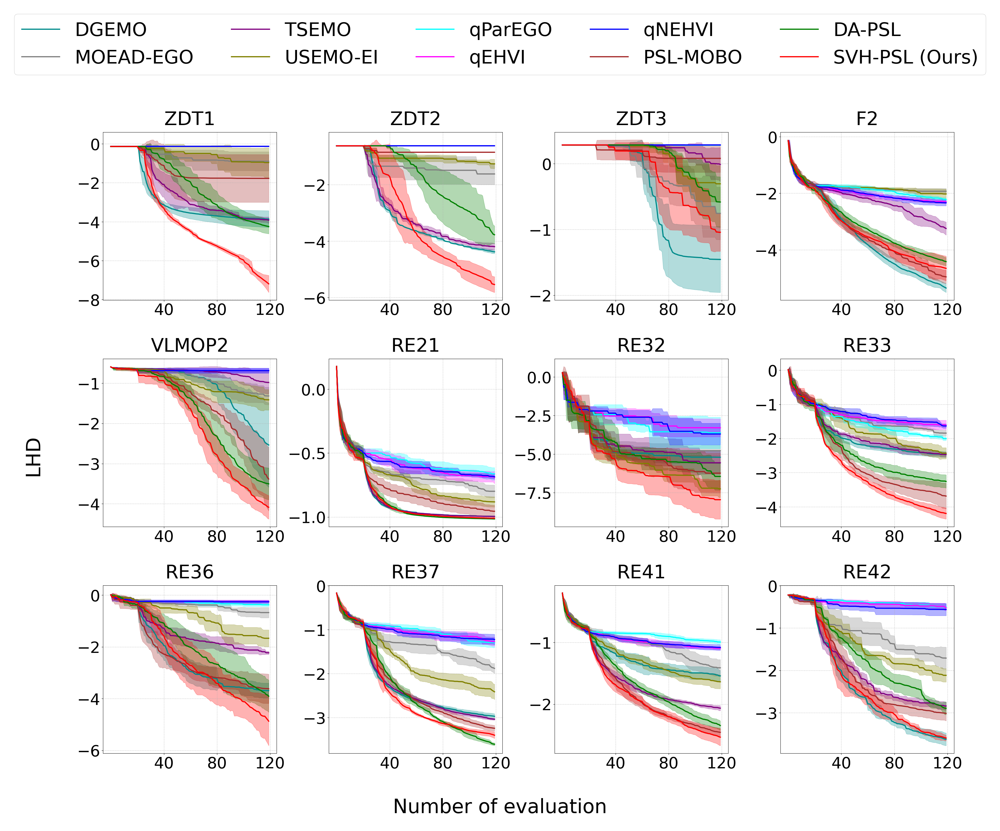

# SVH-PSL: Stein Variational Hypernetworks for Pareto Set Learning
[](https://python.org)
[](https://ojs.aaai.org/index.php/AAAI/article/view/34167)

> **Improving Pareto Set Learning for Expensive Multi-objective Optimization via Stein Variational Hypernetworks**

## 🎯 Overview

SVH-PSL is a novel approach for solving Expensive Multi-objective Optimization Problems (EMOPs) that integrates **Stein Variational Gradient Descent (SVGD)** with **Hypernetworks** for efficient Pareto set learning. Our method addresses the critical challenges of fragmented surrogate models and pseudo-local optima that plague existing approaches.

### Key Features

- 🚀 **Novel Integration**: Combines SVGD with hypernetworks for robust Pareto set learning
- 🎯 **Pseudo-local Optima Avoidance**: Particles interact through kernel functions to escape local traps
- 🔧 **Local Kernel Design**: Custom kernel for dimension-wise particle interaction
- 📊 **Superior Performance**: Significant improvements over baseline methods on synthetic and real-world benchmarks
- ⚡ **Efficient Exploration**: Enhanced diversity while ensuring convergence to optimal fronts

## 🔧 Installation

### Prerequisites

- Python 3.8+
- CUDA-compatible GPU (recommended)

### Quick Install

```bash
# Clone the repository
git clone https://github.com/nguyenduc810/SVH-PSL.git
cd SVH-PSL

# Create virtual environment
python -m venv venv
source venv/bin/activate  # On Windows: venv\Scripts\activate

# Install dependencies
pip install -r requirements.txt
```

### Manual Installation

```bash
pip install torch torchvision
pip install numpy scipy matplotlib
pip install scikit-learn
pip install gpytorch  # For Gaussian Process
pip install pymoo     # For multi-objective optimization benchmarks
```

### Running Experiments

```bash
# Run all experiments
python run_svh.py 
```
## 📈 Evaluation Metrics

- **Log Hypervolume Difference (LHD)**: We use LHD to evaluate the quality of a learned Pareto front. It provides a robust and numerically stable measure for comparing the performance of different algorithms and solution sets.
The LHD is calculated using the following formula:

```
LHD = log(HV_reference - HV_learned)
```

Where:
- `HV_reference`: Hypervolume of the reference Pareto front (the true Pareto front or best-known front)
- `HV_learned`: Hypervolume of the learned Pareto front

Lower LHD values indicate better performance.

## 📊 Experimental Results
### Performance Visualization



*Mean Log Hypervolume Differences between the truth Pareto Front and the learned Pareto Front with respect to the
number of expensive evaluations on all MOBO algorithms*

## 📝 Citation

If you use SVH-PSL in your research, please cite our paper:

```bibtex
@inproceedings{nguyen2025improving,
  title={Improving pareto set learning for expensive multi-objective optimization via stein variational hypernetworks},
  author={Nguyen, Minh-Duc and Dinh, Phuong Mai and Nguyen, Quang-Huy and Hoang, Long P and Le, Dung D},
  booktitle={Proceedings of the AAAI Conference on Artificial Intelligence},
  volume={39},
  number={18},
  pages={19677--19685},
  year={2025}
}
```

## 🔗 Related Work

- [PSL-MOBO](https://proceedings.neurips.cc/paper_files/paper/2022/file/7a583691ccfcf8945ab714b677ccbf0b-Paper-Conference.pdf) - Original Pareto Set Learning approach
- [SVGD](https://arxiv.org/pdf/1608.04471) - Stein Variational Gradient Descent
- [MOO-SVGD](https://proceedings.neurips.cc/paper_files/paper/2021/file/7bb16972da003e87724f048d76b7e0e1-Paper.pdf) - Multi-objective SVGD
- [PHN-HVI](https://arxiv.org/pdf/2212.01130) Multi-sample Hypernetwork  approach 

## 🆘 Support

- 📧 Email: [ducnguyenm810@gmail.com](mailto:ducnguyenm810@gmail.com)
- 🐛 Issues: [GitHub Issues](https://github.com/nguyenduc810/SVH-PSL/issues)
- 💬 Discussions: [GitHub Discussions](https://github.com/nguyenduc810/SVH-PSL/discussions)

## 🙏 Acknowledgments

This research was funded by Vingroup Innovation Foundation (VINIF) under project code VINIF.2024.DA113.

---

<div align="center">
  <strong>⭐ Star us on GitHub if SVH-PSL helps your research! ⭐</strong>
</div>
